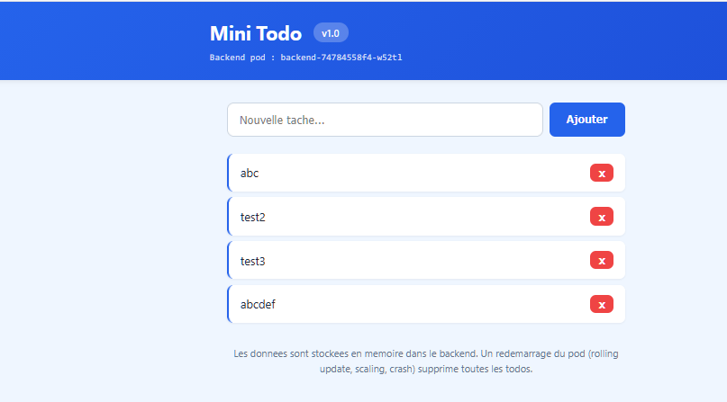
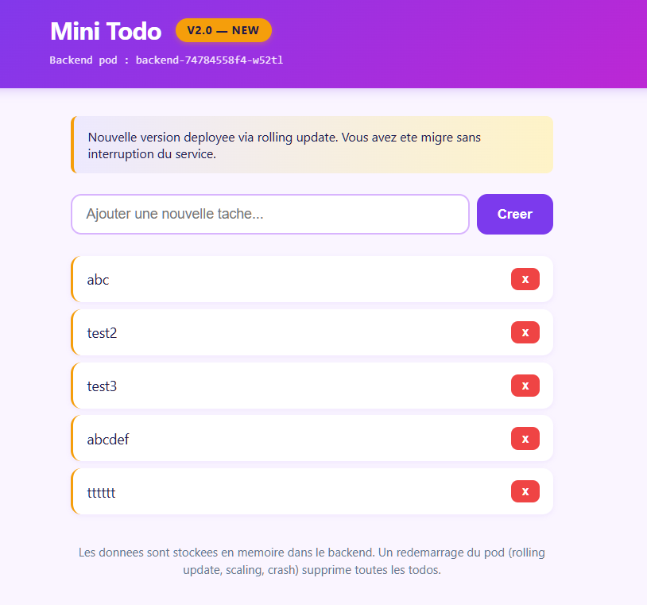
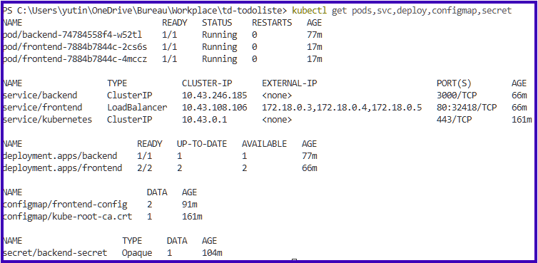

# Prerequis

Création du cluster pour le TD
Environement: Windows

```
k3d cluster create td-k8s --servers 1 --agents 2 --port "8080:80@loadbalancer" --k3s-arg "--disable=traefik@server:0"
kubectl get nodes
```

Ouput:
```
PS C:\Users\yutin\OneDrive\Bureau\Workplace\td-todoliste> k3d cluster create td-k8s --servers 1 --agents 2 --port "8080:80@loadbalancer" --k3s-arg "--disable=traefik@server:0"
INFO[0000] portmapping '8080:80' targets the loadbalancer: defaulting to [servers:*:proxy agents:*:proxy] 
INFO[0000] Prep: Network                                
INFO[0000] Re-using existing network 'k3d-td-k8s' (53b3bec0318f041c9cdfaafd4adcc8e5926e09d8427738b49445be783d87b427) 
INFO[0000] Created image volume k3d-td-k8s-images       
INFO[0000] Starting new tools node...                   
INFO[0000] Starting node 'k3d-td-k8s-tools'             
INFO[0001] Creating node 'k3d-td-k8s-server-0'          
INFO[0001] Creating node 'k3d-td-k8s-agent-0'           
INFO[0001] Creating node 'k3d-td-k8s-agent-1'           
INFO[0001] Creating LoadBalancer 'k3d-td-k8s-serverlb'  
INFO[0002] Using the k3d-tools node to gather environment information 
INFO[0002] Starting new tools node...                   
INFO[0003] Starting node 'k3d-td-k8s-tools'             
INFO[0004] Starting cluster 'td-k8s'                    
INFO[0004] Starting servers...                          
INFO[0004] Starting node 'k3d-td-k8s-server-0'          
INFO[0010] Starting agents...                           
INFO[0011] Starting node 'k3d-td-k8s-agent-0'           
INFO[0011] Starting node 'k3d-td-k8s-agent-1'           
INFO[0016] Starting helpers...                          
INFO[0016] Starting node 'k3d-td-k8s-serverlb'          
INFO[0023] Injecting records for hostAliases (incl. host.k3d.internal) and for 5 network members into CoreDNS configmap... 
INFO[0026] Cluster 'td-k8s' created successfully!       
INFO[0026] You can now use it like this:                
    kubectl cluster-info
```

```shell
PS C:\Users\yutin\OneDrive\Bureau\Workplace\td-todoliste> kubectl get nodes
NAME                  STATUS   ROLES                  AGE     VERSION
k3d-td-k8s-agent-0    Ready    <none>                 5m31s   v1.31.5+k3s1
k3d-td-k8s-agent-1    Ready    <none>                 5m31s   v1.31.5+k3s1
k3d-td-k8s-server-0   Ready    control-plane,master   5m37s   v1.31.5+k3s1
```

```shell
PS C:\Users\yutin\OneDrive\Bureau\Workplace\td-todoliste> docker ps --filter "name=k3d-td-k8s"
CONTAINER ID   IMAGE                            COMMAND                  CREATED         STATUS         PORTS                                           NAMES
e9a9d839d4dc   ghcr.io/k3d-io/k3d-tools:5.8.3   "/app/k3d-tools noop"    6 minutes ago   Up 6 minutes                                                   k3d-td-k8s-tools
114f601d12b5   ghcr.io/k3d-io/k3d-proxy:5.8.3   "/bin/sh -c nginx-pr…"   6 minutes ago   Up 6 minutes   0.0.0.0:8080->80/tcp, 0.0.0.0:61604->6443/tcp   k3d-td-k8s-serverlb
e51495f9975d   rancher/k3s:v1.31.5-k3s1         "/bin/k3d-entrypoint…"   6 minutes ago   Up 6 minutes                                                   k3d-td-k8s-agent-1
398658e1e663   rancher/k3s:v1.31.5-k3s1         "/bin/k3d-entrypoint…"   6 minutes ago   Up 6 minutes                                                   k3d-td-k8s-agent-0
58cfdbe76996   rancher/k3s:v1.31.5-k3s1         "/bin/k3d-entrypoint…"   6 minutes ago   Up 6 minutes                                                   k3d-td-k8s-server-0
```

```
PS C:\Users\yutin\OneDrive\Bureau\Workplace\td-todoliste> docker pull stephanparichon/epsi-k8s-bff:1.0
>> docker pull stephanparichon/epsi-k8s-front:1.0
>> docker pull stephanparichon/epsi-k8s-front:2.0
1.0: Pulling from stephanparichon/epsi-k8s-bff
cf998ddc23af: Pull complete 
5f49c09562dc: Pull complete 
4feea04c1543: Pull complete 
d2e3624464ff: Pull complete 
fff4e2c1b189: Pull complete 
b2cbbfe903b0: Pull complete 
cb73c963d1b3: Pull complete 
Digest: sha256:5b8b532e6cbe984899d5b9bbd55061e8efa22f7360c046909010f3d1bfeaded9
Status: Downloaded newer image for stephanparichon/epsi-k8s-bff:1.0
docker.io/stephanparichon/epsi-k8s-bff:1.0
1.0: Pulling from stephanparichon/epsi-k8s-front
6f2e79bec71f: Pull complete 
81bd8ed7ec67: Pull complete 
34a64644b756: Pull complete 
b464cfdf2a63: Pull complete 
f9ce9734d584: Pull complete 
d7e507024086: Pull complete 
197eb75867ef: Pull complete 
39c2ddfd6010: Pull complete 
61ca4f733c80: Pull complete 
Digest: sha256:7647bd204e4c77484e7a24c46e604bcad7afac1f95ed6a92271bc404687fdae2
Status: Downloaded newer image for stephanparichon/epsi-k8s-front:1.0
docker.io/stephanparichon/epsi-k8s-front:1.0
2.0: Pulling from stephanparichon/epsi-k8s-front
7b116614dbf0: Pull complete 
Digest: sha256:98dab0df3a62fbd081675be48613c6fb30750adf2228402e3c0620892e9d53cc
Status: Downloaded newer image for stephanparichon/epsi-k8s-front:2.0
docker.io/stephanparichon/epsi-k8s-front:2.0
```

```
k3d image import `
  stephanparichon/epsi-k8s-bff:1.0 `
  stephanparichon/epsi-k8s-front:1.0 `
  stephanparichon/epsi-k8s-front:2.0 `
  --cluster td-k8s
```

```
PS C:\Users\yutin\OneDrive\Bureau\Workplace\td-todoliste> kubectl run smoke-nginx --image=nginx:1.27-alpine --port=80 --labels="app=smoke"
pod/smoke-nginx created
PS C:\Users\yutin\OneDrive\Bureau\Workplace\td-todoliste> kubectl expose pod smoke-nginx --type=LoadBalancer --port=80
service/smoke-nginx exposed
PS C:\Users\yutin\OneDrive\Bureau\Workplace\td-todoliste> kubectl get pod,svc
NAME              READY   STATUS    RESTARTS   AGE
pod/smoke-nginx   1/1     Running   0          13s

NAME                  TYPE           CLUSTER-IP     EXTERNAL-IP                        PORT(S)        AGE
service/kubernetes    ClusterIP      10.43.0.1      <none>                             443/TCP        28m
service/smoke-nginx   LoadBalancer   10.43.73.166   172.18.0.3,172.18.0.4,172.18.0.5   80:30686/TCP   7s
```

```
PS C:\Users\yutin\OneDrive\Bureau\Workplace\td-todoliste> kubectl delete pod smoke-nginx
pod "smoke-nginx" deleted
PS C:\Users\yutin\OneDrive\Bureau\Workplace\td-todoliste> kubectl delete svc smoke-nginx
service "smoke-nginx" deleted
PS C:\Users\yutin\OneDrive\Bureau\Workplace\td-todoliste> 
```

Prérequis OK.

# TD Noté - Deploiement Kubernetes

## 4. Etape 1 - Secret

```shell
kubectl create secret generic backend-secret --from-literal=admin-token=s3cr3t-token-td
```

```shell
PS C:\Users\yutin\OneDrive\Bureau\Workplace\td-todoliste> kubectl create secret generic backend-secret --from-literal=admin-token=s3cr3t-token-td
secret/backend-secret created
```

```shell
PS C:\Users\yutin\OneDrive\Bureau\Workplace\td-todoliste> kubectl create secret generic backend-secret --from-literal=admin-token=s3cr3t-token-td
secret/backend-secret created
PS C:\Users\yutin\OneDrive\Bureau\Workplace\td-todoliste> kubectl get secret
NAME             TYPE     DATA   AGE
backend-secret   Opaque   1      43s
PS C:\Users\yutin\OneDrive\Bureau\Workplace\td-todoliste> kubectl describe secret backend-secret
Name:         backend-secret
Namespace:    default
Labels:       <none>
Annotations:  <none>

Type:  Opaque

Data
====
admin-token:  15 bytes
```

On voit bien qu'un secret nommé 'backend-secret' a été créé, de type 'Opaque', avec 1 data entry.

## 5. Etape 2 - ConfigMap

```shell
PS C:\Users\yutin\OneDrive\Bureau\Workplace\td-todoliste> kubectl apply -f manifests/02-configmap.yaml
configmap/frontend-config created
PS C:\Users\yutin\OneDrive\Bureau\Workplace\td-todoliste> kubectl get configmap
NAME               DATA   AGE
frontend-config    2      15s
kube-root-ca.crt   1      70m
PS C:\Users\yutin\OneDrive\Bureau\Workplace\td-todoliste> kubectl describe configmap frontend-config
Name:         frontend-config
Namespace:    default
Labels:       <none>
Annotations:  <none>

Data
====
BACKEND_PORT:
----
3000

BACKEND_HOST:
----
backend


BinaryData
====

Events:  <none>
```

On voit bien une configMap nommée `frontend-config`, et les deux clés `BACKEND_PORT` et `BACKEND_HOST`.

## 6. Etape 3 - Déploiement backend

```
PS C:\Users\yutin\OneDrive\Bureau\Workplace\td-todoliste> kubectl apply -f manifests/03-deployment-back.yaml
deployment.apps/backend created
PS C:\Users\yutin\OneDrive\Bureau\Workplace\td-todoliste> kubectl rollout status deployment/backend
Waiting for deployment "backend" rollout to finish: 0 of 1 updated replicas are available...
deployment "backend" successfully rolled out
```
Le rollout est complet

```
PS C:\Users\yutin\OneDrive\Bureau\Workplace\td-todoliste> kubectl get pods -l app=backend
NAME                       READY   STATUS    RESTARTS   AGE
backend-74784558f4-w52tl   1/1     Running   0          31s
```
Nous avons bien 1 pod en status 'Running' et 'READY' a 1/1.

```
PS C:\Users\yutin\OneDrive\Bureau\Workplace\td-todoliste> kubectl describe deployment backend
Name:                   backend
Namespace:              default
CreationTimestamp:      Sun, 07 Jun 2026 21:04:25 +0200
Labels:                 app=backend
Annotations:            deployment.kubernetes.io/revision: 1
Selector:               app=backend
Replicas:               1 desired | 1 updated | 1 total | 1 available | 0 unavailable
StrategyType:           RollingUpdate
MinReadySeconds:        0
RollingUpdateStrategy:  25% max unavailable, 25% max surge
Pod Template:
  Labels:  app=backend
  Containers:
   backend:
    Image:      stephanparichon/epsi-k8s-bff:1.0
    Port:       3000/TCP
    Host Port:  0/TCP
    Limits:
      cpu:     200m
      memory:  128Mi
    Requests:
      cpu:      50m
      memory:   64Mi
    Readiness:  http-get http://:3000/health delay=3s timeout=1s period=5s #success=1 #failure=3
    Environment:
      ADMIN_TOKEN:  <set to the key 'admin-token' in secret 'backend-secret'>  Optional: false
    Mounts:         <none>
  Volumes:          <none>
  Node-Selectors:   <none>
  Tolerations:      <none>
Conditions:
  Type           Status  Reason
  ----           ------  ------
  Available      True    MinimumReplicasAvailable
  Progressing    True    NewReplicaSetAvailable
OldReplicaSets:  <none>
NewReplicaSet:   backend-74784558f4 (1/1 replicas created)
Events:
  Type    Reason             Age   From                   Message
  ----    ------             ----  ----                   -------
  Normal  ScalingReplicaSet  39s   deployment-controller  Scaled up replica set backend-74784558f4 to 1
```

## Etape 7 - Deployment frontend

```
PS C:\Users\yutin\OneDrive\Bureau\Workplace\td-todoliste> kubectl apply -f manifests/05-service-back.yaml
service/backend created
PS C:\Users\yutin\OneDrive\Bureau\Workplace\td-todoliste> kubectl apply -f manifests/04-deployment-front.yaml
deployment.apps/frontend created
PS C:\Users\yutin\OneDrive\Bureau\Workplace\td-todoliste> kubectl apply -f manifests/06-service-front.yaml
service/frontend created
```

Verification
- Rollout OK :
```
PS C:\Users\yutin\OneDrive\Bureau\Workplace\td-todoliste> kubectl rollout status deployment/frontend
deployment "frontend" successfully rolled out
```

``` On a bien 2 frontend pods, 'running' avec READY 1/1.
PS C:\Users\yutin\OneDrive\Bureau\Workplace\td-todoliste> kubectl get pods -l app=frontend
NAME                        READY   STATUS    RESTARTS   AGE
frontend-7d67fbc858-pmhmv   1/1     Running   0          77s
frontend-7d67fbc858-w4xmq   1/1     Running   0          77s
```

Verification que les variables BACKEND_HOST et BACKEND_PORT sont bien injectés dans les pods : 
```
PS C:\Users\yutin\OneDrive\Bureau\Workplace\td-todoliste> kubectl get pods -l app=frontend
NAME                        READY   STATUS    RESTARTS   AGE
frontend-7d67fbc858-pmhmv   1/1     Running   0          5m33s
frontend-7d67fbc858-w4xmq   1/1     Running   0          5m33s
PS C:\Users\yutin\OneDrive\Bureau\Workplace\td-todoliste> kubectl exec -it frontend-7d67fbc858-w4xmq -- printenv BACKEND_HOST BACKEND_PORT
backend
3000
```

Dans le Deployment, on voit bien le RollingUpdate avec '0 max unavailable, 1 max surge'
```
PS C:\Users\yutin\OneDrive\Bureau\Workplace\td-todoliste> kubectl describe deployment frontend
Name:                   frontend
Namespace:              default
CreationTimestamp:      Sun, 07 Jun 2026 21:15:27 +0200
Labels:                 app=frontend
Annotations:            deployment.kubernetes.io/revision: 1
Selector:               app=frontend
Replicas:               2 desired | 2 updated | 2 total | 2 available | 0 unavailable
StrategyType:           RollingUpdate
MinReadySeconds:        0
RollingUpdateStrategy:  0 max unavailable, 1 max surge
Pod Template:
  Labels:  app=frontend
  Containers:
   frontend:
    Image:      stephanparichon/epsi-k8s-front:1.0
    Port:       80/TCP
    Host Port:  0/TCP
    Limits:
      cpu:     200m
      memory:  64Mi
    Requests:
      cpu:      50m
      memory:   32Mi
    Readiness:  http-get http://:80/health delay=2s timeout=1s period=5s #success=1 #failure=3
    Environment Variables from:
      frontend-config  ConfigMap  Optional: false
    Environment:       <none>
    Mounts:            <none>
  Volumes:             <none>
  Node-Selectors:      <none>
  Tolerations:         <none>
Conditions:
  Type           Status  Reason
  ----           ------  ------
  Available      True    MinimumReplicasAvailable
  Progressing    True    NewReplicaSetAvailable
OldReplicaSets:  <none>
NewReplicaSet:   frontend-7d67fbc858 (2/2 replicas created)
Events:
  Type    Reason             Age   From                   Message
  ----    ------             ----  ----                   -------
  Normal  ScalingReplicaSet  101s  deployment-controller  Scaled up replica set frontend-7d67fbc858 to 2
```

## Appliquer, tester, mettre à jour

### Etape 5 - Tout appliquer et tester

```
PS C:\Users\yutin\OneDrive\Bureau\Workplace\td-todoliste> kubectl get secret backend-secret
NAME             TYPE     DATA   AGE
backend-secret   Opaque   1      64m
```

Application dans cette ordre ( 'unchanged' car déjà appliquer plus tot)
```
PS C:\Users\yutin\OneDrive\Bureau\Workplace\td-todoliste> kubectl apply -f manifests/02-configmap.yaml
configmap/frontend-config unchanged
PS C:\Users\yutin\OneDrive\Bureau\Workplace\td-todoliste> kubectl apply -f manifests/05-service-back.yaml
service/backend unchanged
PS C:\Users\yutin\OneDrive\Bureau\Workplace\td-todoliste> kubectl apply -f manifests/03-deployment-back.yaml
deployment.apps/backend unchanged
PS C:\Users\yutin\OneDrive\Bureau\Workplace\td-todoliste> kubectl apply -f manifests/04-deployment-front.yaml
deployment.apps/frontend unchanged
PS C:\Users\yutin\OneDrive\Bureau\Workplace\td-todoliste> kubectl apply -f manifests/06-service-front.yaml
service/frontend unchanged
```

Vérification 

```
PS C:\Users\yutin\OneDrive\Bureau\Workplace\td-todoliste> kubectl rollout status deployment/backend
deployment "backend" successfully rolled out
PS C:\Users\yutin\OneDrive\Bureau\Workplace\td-todoliste> kubectl rollout status deployment/frontend
deployment "frontend" successfully rolled out
```

```
PS C:\Users\yutin\OneDrive\Bureau\Workplace\td-todoliste> kubectl get pods,svc,deploy,configmap,secret
NAME                            READY   STATUS    RESTARTS   AGE
pod/backend-74784558f4-w52tl    1/1     Running   0          42m
pod/frontend-7d67fbc858-pmhmv   1/1     Running   0          31m
pod/frontend-7d67fbc858-w4xmq   1/1     Running   0          31m

NAME                 TYPE           CLUSTER-IP      EXTERNAL-IP                        PORT(S)        AGE
service/backend      ClusterIP      10.43.246.185   <none>                             3000/TCP       32m
service/frontend     LoadBalancer   10.43.108.106   172.18.0.3,172.18.0.4,172.18.0.5   80:32418/TCP   31m
service/kubernetes   ClusterIP      10.43.0.1       <none>                             443/TCP        127m

NAME                       READY   UP-TO-DATE   AVAILABLE   AGE
deployment.apps/backend    1/1     1            1           42m
deployment.apps/frontend   2/2     2            2           31m

NAME                         DATA   AGE
configmap/frontend-config    2      56m
configmap/kube-root-ca.crt   1      126m

NAME                    TYPE     DATA   AGE
secret/backend-secret   Opaque   1      69m
```

```
PS C:\Users\yutin\OneDrive\Bureau\Workplace\td-todoliste> kubectl get pods -l app=backend
NAME                       READY   STATUS    RESTARTS   AGE
backend-74784558f4-w52tl   1/1     Running   0          43m
```

```
PS C:\Users\yutin\OneDrive\Bureau\Workplace\td-todoliste> kubectl get pods -l app=frontend
NAME                        READY   STATUS    RESTARTS   AGE
frontend-7d67fbc858-pmhmv   1/1     Running   0          33m
frontend-7d67fbc858-w4xmq   1/1     Running   0          33m
```

(Voir screenshot_app_v1.png)



### Etape 6 - Rolling update à observer

Avant le changement :
```
PS C:\Users\yutin\OneDrive\Bureau\Workplace\td-todoliste> kubectl get pods -w
NAME                        READY   STATUS    RESTARTS   AGE
backend-74784558f4-w52tl    1/1     Running   0          56m
frontend-7d67fbc858-pmhmv   1/1     Running   0          45m
frontend-7d67fbc858-w4xmq   1/1     Running   0          45m
```

Changement dans `manifests/04-deployment-front.yaml`:
```
image: stephanparichon/epsi-k8s-front:1.0
```
en 
```
image: stephanparichon/epsi-k8s-front:2.0
```

Application de la config :
```
PS C:\Users\yutin\OneDrive\Bureau\Workplace\td-todoliste> kubectl apply -f manifests/04-deployment-front.yaml
deployment.apps/frontend configured
```

```
PS C:\Users\yutin\OneDrive\Bureau\Workplace\td-todoliste> kubectl rollout status deployment/frontend
Waiting for deployment "frontend" rollout to finish: 1 old replicas are pending termination...
Waiting for deployment "frontend" rollout to finish: 1 old replicas are pending termination...
deployment "frontend" successfully rolled out
```

```shell
PS C:\Users\yutin\OneDrive\Bureau\Workplace\td-todoliste> kubectl describe deployment frontend
```

Résultat:
```
Name:                   frontend
Namespace:              default
CreationTimestamp:      Sun, 07 Jun 2026 21:15:27 +0200
Labels:                 app=frontend
Annotations:            deployment.kubernetes.io/revision: 2
Selector:               app=frontend
Replicas:               2 desired | 2 updated | 2 total | 2 available | 0 unavailable
StrategyType:           RollingUpdate
MinReadySeconds:        0
RollingUpdateStrategy:  0 max unavailable, 1 max surge
Pod Template:
  Labels:  app=frontend
  Containers:
   frontend:
    Image:      stephanparichon/epsi-k8s-front:2.0
    Port:       80/TCP
    Host Port:  0/TCP
    Limits:
      cpu:     200m
      memory:  64Mi
    Requests:
      cpu:      50m
      memory:   32Mi
    Readiness:  http-get http://:80/health delay=2s timeout=1s period=5s #success=1 #failure=3
    Environment Variables from:
      frontend-config  ConfigMap  Optional: false
    Environment:       <none>
    Mounts:            <none>
  Volumes:             <none>
  Node-Selectors:      <none>
  Tolerations:         <none>
Conditions:
  Type           Status  Reason
  ----           ------  ------
  Available      True    MinimumReplicasAvailable
  Progressing    True    NewReplicaSetAvailable
OldReplicaSets:  frontend-7d67fbc858 (0/0 replicas created)
NewReplicaSet:   frontend-7884b7844c (2/2 replicas created)
Events:
  Type    Reason             Age   From                   Message
  ----    ------             ----  ----                   -------
  Normal  ScalingReplicaSet  49m   deployment-controller  Scaled up replica set frontend-7d67fbc858 to 2
  Normal  ScalingReplicaSet  47s   deployment-controller  Scaled up replica set frontend-7884b7844c to 1
  Normal  ScalingReplicaSet  40s   deployment-controller  Scaled down replica set frontend-7d67fbc858 to 1 from 2
  Normal  ScalingReplicaSet  40s   deployment-controller  Scaled up replica set frontend-7884b7844c to 2 from 1
  Normal  ScalingReplicaSet  34s   deployment-controller  Scaled down replica set frontend-7d67fbc858 to 0 from 1
  ```

(Voir screenshot_app_v2.png)



(Voir screenshot_kubectl_all.png)


### Etape 7 - Tester le Secret avec curl

Sans header, la requete est refusée (erreur 401) :
```shell
PS C:\Users\yutin\OneDrive\Bureau\Workplace\td-todoliste> curl.exe -X POST http://localhost:8080/api/admin/clear
```
Résultat
```
{"error":"Token administrateur invalide ou manquant"}
```


```shell
PS C:\Users\yutin\OneDrive\Bureau\Workplace\td-todoliste> curl.exe -X POST http://localhost:8080/api/admin/clear -H "X-Admin-Token: s3cr3t-token-td"
```

```er'd
{"status":"ok","cleared":5,"message":"5 todo(s) supprimée(s)"}
```

Avec le bon header: 
```
curl.exe -X POST http://localhost:8080/api/admin/clear -H "X-Admin-Token: s3cr3t-token-td"
```

```
{"status":"ok","cleared":0,"message":"0 todo(s) supprimée(s)"}
```
